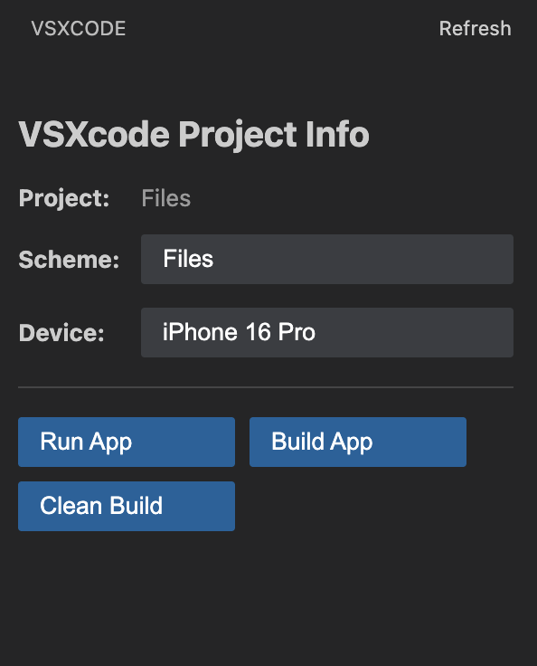

# VSXcode - iOS/macOS Development in VS Code

[](https://github.com/vinayjn/vsxcode/releases)
[](https://opensource.org/licenses/MIT)



VSXcode is a VS Code extension that brings Xcode functionality directly into Visual Studio Code, enabling iOS and macOS development without leaving your editor.

## ✨ Features

- **⚡ Run App** - Build and run your iOS/macOS app on simulator or device
- **🔨 Build App** - Build your app without running it  
- **🧹 Clean Build** - Clean and rebuild your project from scratch
- **📋 Scheme Selection** - Choose which build scheme to use
- **📱 Device Selection** - Select target device or simulator
- **🔍 Auto Project Detection** - Automatically detects `.xcodeproj` and `.xcworkspace` files

## 📦 Installation

### From GitHub Releases
1. Go to the [Releases page](https://github.com/vinayjn/vsxcode/releases)
2. Download the latest `.vsix` file
3. In VS Code: `Cmd+Shift+P` → "Extensions: Install from VSIX..."
4. Select the downloaded file

## 🚀 Quick Start

### Prerequisites
- **macOS** with Xcode installed
- **VS Code** version 1.102.0 or higher
- An iOS/macOS project with `.xcodeproj` or `.xcworkspace` file

### Basic Workflow
1. **Open your Xcode project** in VS Code
2. **Click the VSXcode icon** in the Activity Bar to open the sidebar panel
3. **Select a scheme** by clicking "Select Scheme" button
4. **Select a device** by clicking "Select Device" button
5. **Run your app** by clicking "Run App" button

## 🎯 Sidebar Interface

The VSXcode sidebar provides all functionality through clickable buttons:

### Project Information
- **Project Name** - Currently loaded Xcode project
- **Selected Scheme** - Active build scheme with quick selection button
- **Selected Device** - Target device/simulator with easy switching button

### Action Buttons
- **🚀 Run App** - Build and run on selected device/simulator
- **🔨 Build App** - Build without running
- **🧹 Clean Build** - Clean and rebuild project
- **🔄 Refresh** - Update project information

## ⚙️ Configuration

Configure through VS Code settings:

```json
{
  "vsxcode.xcodePath": "/Applications/Xcode.app/Contents/Developer",
  "vsxcode.defaultScheme": "YourAppScheme",
  "vsxcode.defaultDevice": "iPhone 15 Pro"
}
```

## 🤝 Contributing

### Development Setup
```bash
git clone https://github.com/vinayjn/vsxcode.git
cd vsxcode
npm install
npm run watch    # Watch for changes
# Press F5 in VS Code to launch Extension Development Host
```

### Development Commands
```bash
npm run compile          # Compile TypeScript
npm run package         # Create production VSIX package
npm run lint            # Run ESLint
npm run test            # Run unit tests
```

### Contributing Guidelines
1. Fork the repository and create a feature branch
2. Make your changes with clear, concise commits
3. Run `npm run lint` and `npm run test`
4. Submit a pull request with a clear description

## 📝 License

This project is licensed under the MIT License - see the [LICENSE](LICENSE) file for details.

## 📞 Support

- 🐛 **Bug Reports**: [GitHub Issues](https://github.com/vinayjn/vsxcode/issues)
- 💡 **Feature Requests**: [GitHub Discussions](https://github.com/vinayjn/vsxcode/discussions)

---

**Made with ❤️ by [@vinayjn7](https://x.com/vinayjn7)**